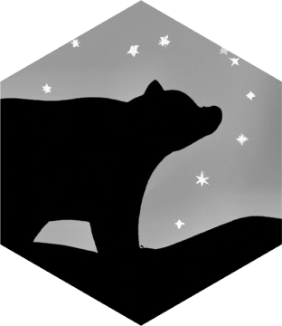

## ursaPGx 

The goal of this package is to use phased VCF data to assign star alleles to
samples using existing frameworks from the
[Bioconductor](https://www.bioconductor.org/) ecosystem and
[PharmVar](https://www.pharmvar.org) database. This package is purpose-built for
annotating the 1000 genomes 30X phased VCF call sets from the NYGC.

## Data Sources

Reference alleles and haplotype definitions are extracted from the most recent
version of [PharmVar](https://www.pharmvar.org/download). See the
`create-reference.R` function in the data-raw directory for the exact script.

The current version of the reference haplotypes from PharmVar is: **Version 5.2.13**

## Installation

This package is still in active development but can be installed with:

```r
# Install the required Bioconductor packages
if (!requireNamespace("BiocManager", quietly = TRUE))
        install.packages("BiocManager")
BiocManager::install("VariantAnnotation")

# Install ursaPGx from github
devtools::install_github("coriell-research/ursaPGx")
```

## Example Analysis

```
# Specify the path the the VCF object
vcf <- "1kGP_high_coverage_Illumina.chr10.filtered.SNV_INDEL_SV_phased_panel.vcf.gz"

# Read in the VCF data as a PGx object for CYP2C19
CYP2C19 <- readPGx(vcf, gene = "CYP2C19")

# Determine what alleles can be called from the data
CYP2C19 <- determineCallableAlleles(CYP2C19)

# Create a reference of all positions from the callable alleles 
CYP2C19 <- buildReferenceDataFrame(CYP2C19)

# Convert the genotype code to nucleotides
CYP2C19 <- convertGTtoNucleotides(CYP2C19)

# Create diplotype calls for every sample
result <- callPhasedDiplotypes(CYP2C19)
head(result)

>        CYP2C19
>HG00096   *2|*1
>HG00097   *1|*1
>HG00099  *17|*1
>HG00100   *1|*1
>HG00101   *1|*1
>HG00102  *17|*1
```